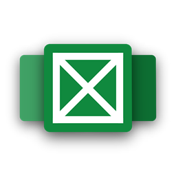
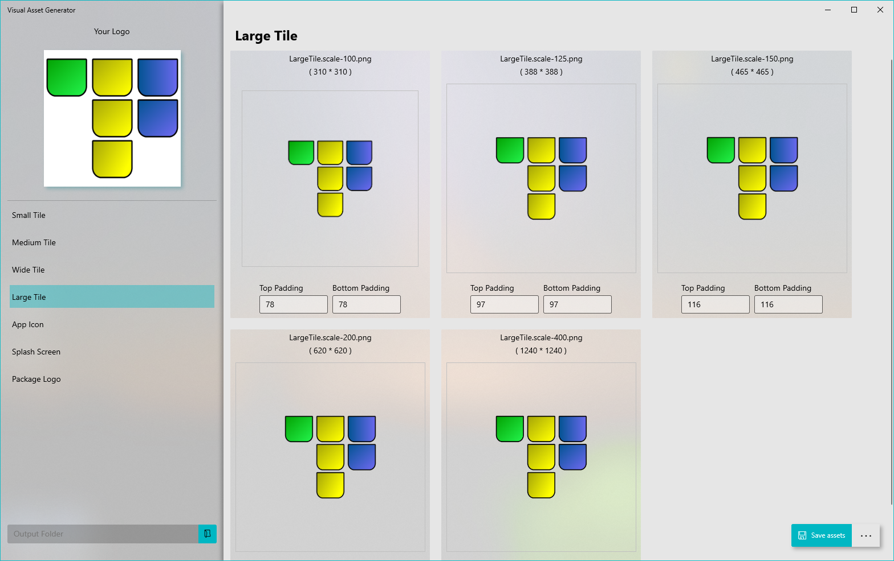

  
  <h1 align="center">UWP-Visual-Asset-Generator</h1>

## This is a project to develop an easy to use visual asset tool for UWP projects.

Immediate goals (2019) are to have the app progress through these stages of capability:
- [x] Accept a base (transparent) image, and then create a single correctly sized and named asset from it.
- [x] Create ALL the assets instead of just one.
- [ ] Allow basic margin manipulation as a group for all assets.
- [x] Allow basic margin manipulation on individual assets.
- [ ] Support different sampling modes for resizing.
- [ ] Option to save/generate only specific assets.
- [ ] Visual guides showing the recommended and applied margins for each asset ([Asset guidelines](https://docs.microsoft.com/en-us/windows/uwp/design/style/app-icons-and-logos))

## Screenshots

## This project is to be free (as in free beer) and open source without ads.

The goal is to help the community make sharp, well alligned assets easily for UWP apps.

## Currently available languages:

- en-US 
- fr-FR
- Soon more ... ([How to participate](https://github.com/UWPCommunity/Quick-Pad/blob/master/translator.md))
